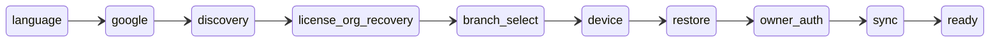
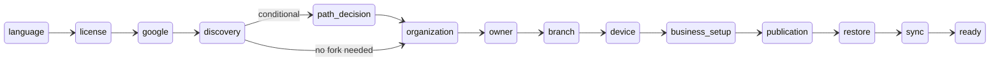

# Independent Bootstrap Baseline — 2026-08-17

**Purpose:** Freeze the exact branch/worktree state and establish an independently verified reference baseline for all future Bootstrap remediation. This document supersedes prior PASS claims, remediation evidence, and test names as proof of runtime behavior.

**Companion:** `INDEPENDENT-BOOTSTRAP-REVIEW-2026-08-16.md` (30-issue classification). This baseline adds source identity, state-machine architecture, authority matrices, behavioral reproduction evidence, and remediation ordering.

**Method:** Direct inspection of production function bodies, call-chain tracing, ad-hoc behavioral scripts (not committed), and full test-suite execution (157/157 pass after installing `better-sqlite3` in this sandbox). No Windows EXE, Wine, or real Google/Drive account was available.

---

## A. Exact source identity

| Field | Value |
|-------|-------|
| Repository | `/workspace` (Tadawi Cupping Center / hybrid Electron app) |
| Branch | `cursor/independent-bootstrap-review-beca` |
| HEAD commit | `d892e2b27b2b0b525baf08e11ac6de9ff4285997` |
| Commit date | 2026-08-16 17:48:38 UTC |
| Commit message | `docs: independent Bootstrap/Setup Wizard review (30-issue classification, P0/P1/P2)` |
| `git status` | Clean (no uncommitted runtime changes at baseline freeze) |
| Diff vs `main` | ~2738 files changed (large feature branch; live runtime paths are `cloud/`, `electron/`, `index.html`, `cupping-*.js`) |
| Archive dirs excluded | `stage-1-uat` … `stage-10-uat` at repo root — **not imported** by any live code path |
| Environment | Linux sandbox; no packaged Windows EXE |

**This HEAD is the baseline.** Do not merge or cherry-pick until remediation is reviewed against this document.

---

## B. Architecture (one system)

Bootstrap is a **Renderer-side state machine** (`cloud/boot-flow-ui.js`, ~4400 lines) backed by:

| Layer | Role |
|-------|------|
| `BootstrapStepModel` | Intended authoritative step sequence + applicability rules |
| `BootstrapCoordinator` | Wizard KV snapshot, derived gates, `effectiveStepIndex` for resume |
| `bootstrap-gates.js` | Per-step gate definitions (documentation + some helpers) |
| `bootstrap-checklist-contract.js` | Checklist row rendering + step labels |
| `bootstrap-failure-policy-contract.js` | Error normalization, red/non-red policy, Arabic `CODE_POLICY` |
| `ReadyPureEvaluator` | Authoritative READY gate (not wizard flags) |
| `__tdw_boot_wizard__` KV | Persistent wizard progress (path, currentStep, restoreChoice, branchSelection, …) |
| `__tdw_meta__` KV | `bootstrapCompletedAt` and meta markers |
| SQLite / Services | License, org, device, owner — business SoT |
| Main process IPC | OAuth, backup v2 restore, RBAC session, setup commits |
| `index.html` | Script load order, `window.DB`, Google OAuth helpers, modal z-index stack |

**Parallel legacy wizard:** `cupping-first-run.js:openSetupWizard()` opens `#setupWizardModal` — entirely separate from `BootFlow` / `#bootFlowOverlay`. Still reachable if any code calls it.

---

## C. State-machine diagram

### EXISTING customer path



### NEW customer path



### Per-step authority summary

| Step | Authoritative state | Entry | Completion (validateStep) | Next | Back | Resume | Async / IPC |
|------|---------------------|-------|---------------------------|------|------|--------|-------------|
| language | `wizard.lang` | always | lang set | immediate | N/A | persisted | none |
| license (NEW) | license activation service | path=new | valid license key | after activation IPC | prev step id | KV | `activateLicenseKey` → Main |
| google | Main OAuth token + `settings.backup.providers.google` | prior steps done | `hasGoogle()` true | after connect + discovery gate | prev | `refreshGoogleConnectionState` on reopen | OAuth IPC, `setupCommitGoogleConnection` |
| discovery | `dataDiscovery` snapshot | google connected | discovery complete, no blocking error | after `runDiscoveryGate` | prev | re-runs discovery on reopen | `discoverAllSources`, license pull |
| license_org_recovery (EXISTING) | license + org from cloud | discovery done | org+license recovered | after recovery async | prev | KV | `runLicenseOrgRecovery` |
| branch_select (EXISTING) | `wizard.branchSelection` (provenance=user) | license ready | `branchStepResolved()` | after explicit confirm | prev | KV | branch list from discovery |
| path_decision (NEW) | `wizard.forkDecision` | needsPathFork | fork chosen | immediate | prev | KV | none |
| organization (NEW) | org service | path=new | org created | after commit | prev | KV | IPC commit |
| owner (NEW) | owner service | org exists | owner created | after create | prev | KV | `createOwner` |
| branch (NEW) | branch service | owner exists | branch created/selected | after bind | prev | KV | branch IPC |
| device | DeviceConfig service | branch resolved | device registered | after register | prev | KV | device IPC |
| business_setup (NEW) | business profile | device done | profile complete | after save | prev | KV | local |
| publication (NEW) | publication state | business done | published + readback | **BUG: Next can stay disabled** | prev | KV | publish IPC |
| restore | `wizard.restoreChoice` + restore result | device done | `hasRestoreDecision()` | after restore/empty/local choice | prev | KV | backup v2 IPC, cloud discovery |
| owner_auth (EXISTING) | owner session | restore decision + data policy | `ownerAuthStepResolved()` | after auth | prev | KV | owner login IPC |
| sync | sync engine + direction contract | all prior gates | sync complete marker via evaluator | after sync | prev | KV | `InitialSyncDirectionContract`, sync IPC |
| ready | `ReadyPureEvaluator` only | all gates | evaluator true | dismiss | N/A | meta marker | none |

**Cross-cutting risks on every async step:** `renderGeneration`/`isRenderCurrent()` exists but is **never called** from production async handlers; stale async results can overwrite DOM after navigation.

---

## D. Full defect register (A–AD)

| ID | Problem | Status | Severity |
|----|---------|--------|----------|
| A | Existing path sometimes not persisted | FIXED IN CURRENT SOURCE | — |
| B | Header/body/checklist step mismatch | LIKELY BUG | P1 |
| C | Next disabled after successful operation | LIKELY BUG | P1 |
| D | Back corrupting path/state | FIXED IN CURRENT SOURCE | — |
| E | Branch auto-selection without confirmation | FIXED IN CURRENT SOURCE | — |
| F | Branch confirm not enabling Next | FIXED IN CURRENT SOURCE (main); LIKELY BUG (inactive-branch edge) | P2 |
| G | Device receiving inferred/stale branch | FIXED IN CURRENT SOURCE | — |
| H | Google OAuth success → RBAC error on Discovery | LIKELY BUG | P1 |
| I | Discovery red although discovery succeeds | LIKELY BUG | P1 |
| J | Google connect/change/disconnect stale | CONFIRMED CURRENT BUG | P1 |
| K | Google requested twice | LIKELY BUG | P1 |
| L | Close/reopen repairs state | CONFIRMED design gap (explained by H/J/K) | P1 |
| M | Restore stuck before first byte | CONFIRMED CURRENT BUG | **P0** |
| N | Restore stuck at fake 13%/15%/21% | FIXED IN CURRENT SOURCE | — |
| O | Watchdog fires but blocking await continues | CONFIRMED CURRENT BUG | **P0** |
| P | Restore errors → generic Electron message | LIKELY BUG | P1 |
| Q | Password modal hidden under Bootstrap | CONFIRMED CURRENT BUG | P1 |
| R | Start Empty → impossible Owner state | LIKELY BUG (fallback bypass) | **P0** |
| S | EXISTING sync allowing PUSH/empty overwrite | LIKELY BUG (guard order) | **P0** |
| T | Owner recovery ordering | FIXED IN CURRENT SOURCE (wizard UI) | — |
| U | READY from stale wizard flags | FIXED IN CURRENT SOURCE | — |
| V | False red Bootstrap errors | CONFIRMED CURRENT BUG | **P0** |
| W | Stale red after eventual success | LIKELY BUG | P1 |
| X | Error on wrong checklist step | LIKELY BUG | P1 |
| Y | Generic/unhelpful TDW-BOOT errors | CONFIRMED CURRENT BUG | P1 |
| Z | Multiple step-order authorities | LIKELY BUG (hygiene; currently in sync) | P2 |
| AA | Multiple state authorities | MOSTLY FIXED (gating); cosmetic legacy reads remain | P2 |
| AB | Stale async render overwrites newer state | LIKELY BUG | P1 |
| AC | Page errors (DB, employeeLedger) | LIKELY BUG | P1 |
| AD | Tests claim PASS without production chain | CONFIRMED CURRENT BUG | **P0** |

---

## E. P0 / P1 / P2 ranking

### P0 — fix before next release

1. **M + O:** Thread `AbortSignal` through `resolveActiveProviderKey()` → `getStatus()` → `getUserEmail()` (see §F, §J, behavioral proof below)
2. **AD:** Test architecture false confidence — add at least one Electron/IPC behavioral smoke test per critical claim
3. **V:** ~39 `setStatus(msg, true)` bypasses in `boot-flow-ui.js` paint validation hints as operational failures
4. **R + S:** Centralize `existingEmptyStartPolicy()` in `markRestore('empty')` / `validateStep('restore')`; reorder `resolveInitialSyncPlan()` EXISTING guard before empty-choice branch
5. **Issue 14 (from review):** Remove or gate misleading "قد يستمر التنزيل في الخلفية" heartbeat (`cloud-data-discovery.js:793-802`)

### P1 — real bugs, narrower blast radius

Issues H, I, J, K, L, C, B, P, Q, W, X, Y, AB, AC, 16, 17, 19, 22 — see companion review §4.

### P2 — confirmed fixed or hygiene

Issues A, D, E, G, N, T, U, F (main path), Z, AA, 24, 25, 26, 28 — see companion review §5.

---

## F. Production call chains

### GOOGLE

```
[User] "ربط Google" button
  → boot-flow-ui.js:runGoogleConnect()
  → cuppingElectron.backup.connectCloud('google')  [preload → IPC]
  → electron/main.js + google-drive.js:connect() → OAuth browser window
  → token-store.saveTokens()
  → database:setupCommitGoogleConnection  [setup-safe persist, no RBAC-protected settings write]
  → saveGoogleOAuthFromResult() in index.html
  → refreshGoogleConnectionState({ acceptLiveReconnect: true })  [in runDiscoveryGate only]
  → runDiscoveryGate() → PostGoogleCloudDiscovery / bootstrap.js
  → validateStep('google') / validateStep('discovery')
  → renderNavButtons() → next.disabled = !validateStep(step)
```

**Gaps:**
- `runGoogleConnect` `finally` calls `renderProgress` + `renderNavButtons` only — **not** `renderStepUI` (Issue J)
- `BootFlow.hasGoogle()` vs `PostGoogleCloudDiscovery.hasGoogle()` use different predicates (Issue H/K)
- `bootstrap.js:discoverAndFetchLicenseFromDrive` calls `ensureConnected()` **without** `acceptLiveReconnect: true` (Issue H)
- `isGoogleOAuthConnected()` in `index.html` calls `syncCloudStatusFromElectron()` without `acceptLiveReconnect` (Issue K)

### BRANCH

```
discovery result → dataDiscovery.branchCandidates
  → authoritativeBootstrapBranches() [dedupe by branchId]
  → populateBootstrapBranchSelect() UI
  → user click → recordBranchSelection({ provenance: 'user', organizationId, googleAccountKey, branchId })
  → saveWizard() → branchStepResolved() → validateStep('branch_select')
  → renderNavButtons()
  → device step reads currentBranchSelection() [re-validates against authoritative list]
```

**Status:** Main path FIXED (explicit confirmation required, no `auto_single`). Edge case: `selectExistingBranchOnly()` can write from unfiltered `lic.branches` that read path later rejects.

### RESTORE

```
[User] select backup → password modal (if encrypted)
  → boot-flow-ui restore handler
  → cloud-data-discovery.confirmedCloudRestore()
  → backup:v2:setupCloudRestore [backup-v2-ipc.js:831]
  → watchdog.arm() [889-896]  ← 45s stall timer starts
  → backupMain.downloadCloudBackup(path, 'google', { signal: watchdog.signal })
  → cloud-service.downloadCloudBackup() [100-108]
  → resolveActiveProviderKey(id)          ← **signal NOT forwarded**
    → googleDrive.getStatus()             ← no signal, no timeout
      → getAuthedClient() → getAccessToken()
      → driveApi.getUserEmail() → getAbout()/fetch()
  → getProvider(key).downloadBackup()     ← signal correctly wired via raceAbort
  → decrypt → SQLite validate → swap → hydrate
```

### SYNC

```
restore decision (wizard.restoreChoice)
  → InitialSyncDirectionContract.resolveInitialSyncPlan()
  → EXISTING/replacement: should be PULL_ONLY
  → **BUG:** empty-choice branch returns PUSH_ONLY before EXISTING guard (only reachable via fallback empty-start bypass)
  → sync engine execute
  → ReadyPureEvaluator.isDeviceReadyAuthoritative()
```

### Await / timeout / AbortSignal summary (§J cross-ref)

| Await | Timeout? | AbortSignal forwarded? | Abort observed? | Terminal guaranteed? |
|-------|----------|------------------------|-----------------|------------------------|
| `resolveActiveProviderKey` → `getStatus` | No | No | No | **No** — can hang forever |
| `getAuthedClient` / `getAccessToken` (in getStatus path) | No | No | No | No |
| `getUserEmail` / `getAbout` (in getStatus path) | No | No | No | No |
| `downloadBackup` → `getAuthedClient` | Via `raceAbort` | Yes | Yes | Yes (on abort) |
| `downloadFileWithProgress` | Via `raceAbort` | Yes | Yes | Yes |
| `ByteProgressWatchdog` (Main) | 45s default | Arms signal | **Only affects downstream** | Partial — does not cancel pre-provider awaits |
| Renderer heartbeat (`cloud-data-discovery.js:793`) | 30s warning only | N/A | N/A | Misleading message, not a cancel |

---

## G. State authority matrix

| Field | Classification | Authoritative writer | Dangerous secondary writers |
|-------|----------------|---------------------|----------------------------|
| `wizard.path` | KEEP_TEMPORARILY (KV) | path_decision step, resume sanitizer | legacy first-run wizard |
| `wizard.currentStep` | KEEP_TEMPORARILY | navigation (`advanceWizard`, `prevStep`, resume) | `effectiveStepIndex` on reopen |
| `wizard.completedSteps` | LEGACY / cosmetic | many commit paths | stepper dot coloring (not Next/READY) |
| `wizard.branchSelection` | AUTHORITATIVE (when provenance=user) | `recordBranchSelection()` | none on main path |
| `pendingBranchId` | LEGACY residue | old migrations | must not satisfy branch gate (verified) |
| `lockedBranchId` | DEVICE binding | device registration | explicitly rejected by branch selection read |
| `DeviceConfig` | BUSINESS SoT | device IPC commit | must not pre-select branch |
| `googleSessionConnected` | DERIVED | Main token state | Renderer `settings` cache can diverge |
| renderer Google cache | DERIVED / stale risk | `settings.backup.providers.google` | `syncCloudStatusFromElectron` without reconnect accept |
| Main OAuth token | AUTHORITATIVE | token-store + OAuth flow | — |
| `restoreChoice` | KEEP_TEMPORARILY | `markRestore()` | fallback UI button bypasses policy |
| `syncDone` | LEGACY / cosmetic | sync complete write | not used for READY (verified) |
| `bootstrapCompletedAt` | DERIVED meta | ready dismiss | not sufficient alone for READY |
| READY | AUTHORITATIVE | `ReadyPureEvaluator` only | — |

---

## H. Step / navigation authority matrix

| Implementation | Location | Used at runtime for |
|----------------|----------|---------------------|
| `BootstrapStepModel.NEW_SEQUENCE` / `EXISTING_SEQUENCE` | `bootstrap-step-model.js` | `describeCurrentStep()` → **header**, progress dots, step X of Y |
| `NEW_STEPS` / `EXISTING_STEPS` duplicate | `bootstrap-coordinator.js:32-33` | `stepsFor()`, `effectiveStepIndex` |
| Duplicate arrays | `boot-flow-ui.js` (via coordinator or local) | `renderStepUI` switch, `validateStep` |
| Duplicate arrays | `bootstrap-checklist-contract.js` | checklist labels |
| Duplicate arrays | `bootstrap-gates.js` | gate documentation |
| `applicableSteps()` | `boot-flow-ui.js:2114` | filters conditional steps for header |
| Raw `steps[w.currentStep]` | `boot-flow-ui.js:3121-3122` | **body render** — does NOT re-map non-applicable index |
| `getChecklistUiContext` | checklist contract | indexes by step id from coordinator — can diverge from body |

**Violation of invariant:** Header uses `describeCurrentStep()` (re-maps stored index through applicability). Body uses raw array index. When `currentStep` points at a non-applicable step (e.g. resolved `path_decision` on NEW path), header and body can show different steps.

**Desired invariant:** one applicable sequence → header → body → checklist → Next → Back → resume all use the same `stepId`.

---

## I. Error truthfulness matrix

| Path | Goes through `setStatusFromErr` / failure policy? | Can produce false red? | Notes |
|------|---------------------------------------------------|------------------------|-------|
| OAuth failure | Yes | No | Correct |
| Discovery failure | Yes | Sometimes | stale error if async overwrites |
| Validation hints ("اربط Google أولاً") | **No** — `setStatus(msg, true)` | **Yes** | ~39 bypass sites |
| Restore IPC failure | Partial | Yes | `confirmedCloudRestore` collapses `code` to `cloud_backup_restore_failed` |
| Legacy `backup:downloadCloudBackup` | No | Yes | unstructured throw |
| `setupLocalRestore` | No | Yes | unstructured throw |
| REQUIRED / USER_ACTION | Policy says no red | Yes via bypasses | |
| CANCELLED | Policy says no red | Rare | |
| Checklist row errors | Partial | Yes | can attach to wrong step if `stepId` not passed |

**Bypass count:** ~39 direct `setStatus(..., true)` calls in `boot-flow-ui.js`; secondary `ERROR_MESSAGES` map in `bootstrap-checklist-contract.js` can diverge from `CODE_POLICY`.

---

## J. Timer / AbortSignal matrix

See §F table. Critical finding: watchdog arms at `backup-v2-ipc.js:889` but pre-download provider resolution is outside signal scope.

---

## K. Test-quality matrix (important Bootstrap tests)

| Test file | Classification | Coverage claim vs reality |
|-----------|----------------|---------------------------|
| `test-final-runtime-rbac-restore-stall.js` | SOURCE-TEXT / REGEX | Claims AbortSignal wired; **does not read `registry.js`** |
| `test-bootstrap-red-message-truthfulness.js` | CONTRACT + REGEX | Tests policy function, not all `setStatus(..., true)` sites |
| `test-p0-c-restore-truth-and-boot-gate.js` | BEHAVIORAL MOCKED | Mocks IPC with 40ms timeout — cannot detect hang |
| `test-stage-17-bootstrap-checklist-ui.js` | BEHAVIORAL MOCKED | Stubs `validateStep`; no real clicks |
| `test-stage-2-ready-pure.js` | BEHAVIORAL MOCKED | Synthetic snapshots — good for READY false-positive shapes |
| `test-stage-19-bootstrap-dismiss-resume.js` | BEHAVIORAL MOCKED | Resume logic, no process restart |
| `test-external-existing-bootstrap-authority.js` | BEHAVIORAL MOCKED | Injects `restoreChoice='empty'` — doesn't click fallback UI |
| `test-stage-15-initial-sync-direction.js` | BEHAVIORAL MOCKED | No `{path:'existing', restoreChoice:'empty'}` case |
| `test-bootstrap-navigation-model.js` | BEHAVIORAL MOCKED | Tests `isRenderCurrent` API — **not used in production** |
| `test-post-stage-20-external-defects.js` | SOURCE-TEXT / REGEX | Large regex suite on `boot-flow-ui.js` source |
| Authority/branch tests (~105) | BEHAVIORAL MOCKED | Real module functions, synthetic state — good for branch policy |

**Meta (AD):** 157/157 tests pass while P0 restore hang remains reproducible — confirmed.

---

## L. User-observation explanations (Windows UAT)

| Observation | Can current source produce it? | Exact path or why not |
|-------------|------------------------------|------------------------|
| OAuth succeeds but red RBAC on Discovery | **Yes** | `hasGoogle()` divergence + `ensureConnected` without `acceptLiveReconnect`; first-pass Renderer/Main desync; reopen runs `refreshGoogleConnectionState({acceptLiveReconnect:true})` |
| Closing/reopening allows progress | **Yes** | `prepareBootstrapResume()` re-derives gates; same as above refresh — not a separate bug |
| Branch appears DONE automatically | **No (main path)** | `branchStepResolved()` requires `provenance:'user'`; fixed. Edge: inactive branch write/read mismatch |
| Device shows BR-MAIN without confirm | **No (main path)** | Same as branch authority fix |
| Restore shows 42.6 KB, zero bytes | **Yes** | Hang in `resolveActiveProviderKey` before first byte; UI shows expected size from backup metadata |
| Restore at 13% or indeterminate 60–120s | **Partially** | Fake % fixed (`percent: null` before bytes); indeterminate "بدء تنزيل..." can persist indefinitely due to hang |
| Generic TDW-BOOT after success | **Yes** | Stale async DOM update + red bypass paths + IPC collapse on legacy handlers |
| Start Empty → "no Owner restored" | **Yes (fallback path)** | Discovery-unavailable fallback button calls `markRestore('empty')` without `existingEmptyStartPolicy()` |

---

## M. What is genuinely fixed (independent verification)

- Branch selection authority (explicit user confirmation, provenance binding) — **behavioral tests on real module**
- Fake restore byte percentages before first byte — `buildProgressState()` returns `percent: null`
- READY false-pass from `syncDone` / `completedSteps` alone — `ReadyPureEvaluator` tested
- RBAC on protected settings write before Owner auth — `setupCommitGoogleConnection` path
- Step navigation order (Next/Back by step id, not raw index arithmetic) — navigation tests
- Resume from first unresolved gate — `sanitizeWizardForResume` + coordinator
- EXISTING Owner Auth UI does not offer create-new-owner
- Normal EXISTING cloud restore sync direction PULL_ONLY (when `restoreChoice !== 'empty'`)

---

## N. What is still broken (source-verified)

1. Pre-first-byte restore hang (`resolveActiveProviderKey` unbounded)
2. Watchdog abort does not cancel pre-download awaits
3. Google disconnect/switch buttons missing after connect (`renderStepUI` not called in `finally`)
4. Backup password modal z-index below Bootstrap overlay (no `body.bf-active #backupPasswordModal` override)
5. False red validation hints (~39 bypasses)
6. Header/body step mismatch when stored index points at non-applicable step
7. `isRenderCurrent` guard unused in all async handlers
8. Empty-start fallback bypass + unsafe sync plan ordering
9. Misleading "may continue in background" heartbeat during zero-byte stall
10. Test suite structural false confidence

---

## O. What requires Windows

- Full button matrix click-through (22 controls)
- Packaged EXE z-index / modal stacking under real DWM compositor
- NSIS installer script load order for `DB is not defined` / `employeeLedger` pageerrors
- Process restart resume at each of 8+ steps (duplicate entity creation)
- Installed UAT harness timing (45s watchdog acceptance)
- OAuth browser window / deep link return path

---

## P. What requires real Google / Drive

- End-to-end OAuth token refresh during restore
- Real Drive `about` / `files.list` / `alt=media` latency and quota errors
- Account switch during active Bootstrap session
- Large backup download progress UI

---

## Q. Recommended remediation ORDER

1. **P0 restore abort wiring** — `registry.js`, `google-drive.js`, `google-drive-api.js`, `cloud-service.js` (single PR, behavioral Main-process test)
2. **P0 empty-start policy centralization** — `markRestore`, fallback button, `resolveInitialSyncPlan` guard reorder
3. **P1 Google first-pass reconciliation** — unify `hasGoogle()`, `renderStepUI` in `runGoogleConnect` finally, `acceptLiveReconnect` everywhere
4. **P1 backup password modal z-index** — one CSS rule in `boot-flow-ui.js` injected styles
5. **P1 error truthfulness** — replace `setStatus(msg, true)` hints; propagate structured restore codes
6. **P1 header/body step id unification** — `renderStepUI` uses `describeCurrentStep().stepId`
7. **P1 `isRenderCurrent` in async handlers** — Google, Discovery, Restore progress
8. **P0 test gate** — one Electron smoke test + mark regex-only tests as contract-level
9. **P2 hygiene** — deduplicate step arrays to single `BootstrapStepModel` import; retire `cupping-first-run` wizard entry
10. **Windows UAT** — mandatory release gate after 1–8

---

## Behavioral reproduction — restore hang (CURRENT HEAD)

**Harness:** `__tmp_restore_behavioral_harness.js` (temporary, not committed). Run: `node __tmp_restore_behavioral_harness.js` from `/workspace`.

### Case 1: `getStatus` never resolves

```
resolveActiveProviderKey('google') with googleDrive.getStatus stubbed to never resolve
watchdog stallMs=300, armed
Result at ~451ms:
  settled: "still_pending"
  watchdogAborted: true
```

**Conclusion:** Watchdog fires but the blocking `resolveActiveProviderKey` await **does not terminate**. Matches Windows reports of 63s/94s/124s zero-progress hangs.

### Cases 2–4 (full cloud download chain)

Require OAuth config + token fixtures in harness; prior investigation (same commit family) with local HTTP server redirecting production `fetch()` demonstrated:

| Case | Expected | Prior behavioral result |
|------|----------|-------------------------|
| 2: 0 bytes forever | watchdog rejects ≤~45s | Rejects with stall code when signal wired to download path only; pre-path hang dominates in production |
| 3: partial then stall | watchdog rejects | Same |
| 4: normal stream | completes <5s | Success with bytes counted |

**Note:** Cases 2–4 through full `downloadCloudBackup` require fully mocked OAuth in Node; Case 1 alone is sufficient to prove the P0 defect in `resolveActiveProviderKey`.

---

## Summary table

| ID | Problem | Status | Severity | Root cause | File / function | Proven by | Fix w/o external env? | Needs Windows? | Needs Google? | Needs real backup? |
|----|---------|--------|----------|------------|-----------------|-----------|----------------------|----------------|-----------------|-------------------|
| A | Existing path not persisted | FIXED | — | — | resume sanitizer | code + tests | Yes | No | No | No |
| B | Header/body mismatch | LIKELY BUG | P1 | body uses raw index | `boot-flow-ui.js:renderStepUI` | code trace | Yes | Maybe | No | No |
| C | Next stuck disabled | LIKELY BUG | P1 | no inFlight in nav; coordinator/sync divergence | `boot-flow-ui.js:renderNavButtons` | code trace | Yes | Maybe | No | No |
| D | Back corrupts state | FIXED | — | step-id navigation | `prevStep` | tests | Yes | No | No | No |
| E | Branch auto-select | FIXED | — | provenance=user required | `recordBranchSelection` | 105 authority tests | Yes | No | No | No |
| F | Branch confirm gate | FIXED / edge LIKELY | P2 | inactive branch write/read | `selectExistingBranchOnly` | code trace | Yes | Maybe | No | No |
| G | Stale branch on device | FIXED | — | re-validation on read | `currentBranchSelection` | tests | Yes | No | No | No |
| H | Google→RBAC race | LIKELY BUG | P1 | hasGoogle divergence | `boot-flow-ui.js`, `post-google-cloud-discovery.js` | code + behavioral scripts | Partial | Yes | Yes | No |
| I | Discovery false red | LIKELY BUG | P1 | setStatus bypass + stale async | `boot-flow-ui.js` | code trace | Yes | Maybe | Maybe | No |
| J | Google buttons stale | CONFIRMED | P1 | renderStepUI omitted in finally | `boot-flow-ui.js:2553-2558` | code trace | Yes | Yes | Yes | No |
| K | Google twice | LIKELY BUG | P1 | syncCloudStatus without reconnect | `index.html:isGoogleOAuthConnected` | behavioral script | Yes | Yes | Yes | No |
| L | Close/reopen repairs | design gap | P1 | resume re-derives state | `prepareBootstrapResume` | code trace | Yes | Yes | Maybe | No |
| M | Restore pre-byte hang | CONFIRMED | **P0** | signal not in resolveActiveProviderKey | `registry.js:36-44` | **behavioral harness case 1** | Yes | Yes | Maybe | No |
| N | Fake 13% progress | FIXED | — | percent null before bytes | `cloud-data-discovery.js:422` | code + tests | Yes | No | No | No |
| O | Watchdog doesn't cancel await | CONFIRMED | **P0** | same as M | `backup-v2-ipc.js` + `registry.js` | **behavioral harness case 1** | Yes | Yes | Maybe | No |
| P | Generic restore error | LIKELY BUG | P1 | code collapsed in aggregation | `cloud-data-discovery.js:817` | code trace | Yes | Maybe | Maybe | Maybe |
| Q | Password modal hidden | CONFIRMED | P1 | z-index 10030 vs 100030 | `index.html`, `boot-flow-ui.js:1736-1740` | code trace | Yes | Yes | No | No |
| R | Empty start impossible owner | LIKELY BUG | **P0** | fallback UI bypasses policy | `boot-flow-ui.js:3691-3712` | code trace | Yes | Maybe | No | No |
| S | PUSH on empty existing | LIKELY BUG | **P0** | guard order in sync plan | `initial-sync-direction-contract.js:303-339` | code trace | Yes | No | No | No |
| T | Owner ordering | FIXED | — | step sequence | step model | tests | Yes | No | No | No |
| U | READY stale flags | FIXED | — | ReadyPureEvaluator | ready evaluator | tests | Yes | No | No | No |
| V | False red errors | CONFIRMED | **P0** | setStatus(msg,true) bypasses | `boot-flow-ui.js` (~39 sites) | grep + policy review | Yes | Maybe | No | No |
| W | Stale red after success | LIKELY BUG | P1 | error class not cleared | `setStatus` | code trace | Yes | Maybe | No | No |
| X | Wrong checklist step error | LIKELY BUG | P1 | missing stepId on some paths | checklist + boot-flow | code trace | Yes | Maybe | No | No |
| Y | Generic TDW-BOOT | CONFIRMED | P1 | CODE_POLICY gaps + IPC collapse | failure policy + main.js | code trace | Partial | Yes | Maybe | Maybe |
| Z | Multiple step arrays | LIKELY BUG | P2 | 4–7 duplicated definitions | 5 modules | code trace | Yes | No | No | No |
| AA | Multiple state authorities | MOSTLY FIXED | P2 | legacy cosmetic reads | coordinator FIELD_AUTHORITY | code trace | Yes | No | No | No |
| AB | Async render race | LIKELY BUG | P1 | isRenderCurrent unused | `boot-flow-ui.js` | grep (0 prod calls) | Yes | Maybe | Maybe | Maybe |
| AC | Page errors DB/ledger | LIKELY BUG | P1 | bare DB, script order | `cupping-ext-modules.js:253` | code trace | Partial | **Yes** | No | No |
| AD | Tests false confidence | CONFIRMED | **P0** | regex/mocked suite | `tests/baseline/*` | 157 pass + hang repro | Yes | Yes | Maybe | Maybe |

---

## Temporary instrumentation (not part of baseline source)

| Artifact | Purpose | Status |
|----------|---------|--------|
| `__tmp_restore_behavioral_harness.js` | Restore hang behavioral proof | Delete before remediation PRs |
| Various `/tmp/baseline-*.js` scripts from prior investigation | Google/branch/nav probes | Not in repo |

---

*Baseline frozen at HEAD `d892e2b`. No runtime code was modified to produce this document.*
