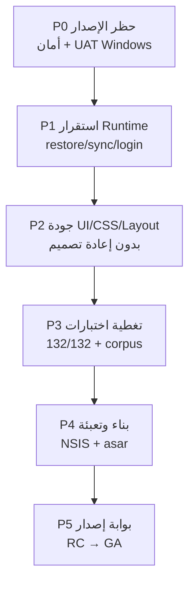

# خطة الإصلاح والمراجعة والتدقيق حتى الجاهزية الإنتاجية
## نظام إدارة الحجامة — Electron 2.0.1

**تاريخ الإعداد:** 13 أغسطس 2026  
**مبني على:** المراجعة المستقلة (`INDEPENDENT-ORIGINAL-VS-CURRENT-REVIEW.md`)  
**الحالة الحالية:** Production Candidate **NO** | Commercial Release **NO**

---

## 0. تعريف «جاهز للإنتاج» (واقعي)

| الهدف | قابل للتحقيق؟ | المعيار |
|-------|---------------|---------|
| صفر أخطاء في كل السيناريوهات | **لا** — غير واقعي لأي نظام ERP/عيادة | — |
| لا أخطاء Critical/High مفتوحة | **نعم** | سجل أخطاء مغلق + UAT مثبت |
| 132/132 اختبار PASS | **نعم** (مع قرار V5 واضح) | exit code 0 |
| UAT Windows كامل | **نعم** | 18 رحلة runtime مُثبتة |
| أمان تجاري مقبول | **قرار مالك** | إما نقل V5 لـ Main أو إفصاح + بوابة |

**قاعدة الإطلاق:** أي Critical = **FAIL** أو **UNVERIFIED** يبقي الإصدار **NO-GO**.

---

## 1. خارطة المراحل (نظرة عامة)



| المرحلة | الهدف | مخرجات القبول |
|---------|-------|---------------|
| **P0** | إزالة حظر الإصدار الحرج | OAuth آمن، UAT Windows، قرار V5 |
| **P1** | استقرار المسارات الحرجة | 18 رحلة runtime PASS على مثبت |
| **P2** | UI/CSS/Layout متسق عربي | قائمة فحص بصرية + RTL + طباعة |
| **P3** | اختبارات كاملة | 132/132 + XSS corpus + IPC matrix |
| **P4** | حزمة إنتاج | EXE موقّع + فحص أسرار |
| **P5** | إطلاق | Production Candidate: YES |

---

## 2. P0 — حظر الإصدار (أولوية قصوى)

### 2.1 قرار تجاري Legacy V5 (قرار مالك — لا يُتخطى)

**الوضع الحالي:** `LIC_SECRETS` في `license/core/license-crypto.js` — المولّد يعمل والبوابة التجارية تفشل.

| الخيار | الوصف | تأثير الاختبارات | المخاطر |
|--------|-------|------------------|---------|
| **A — إبقاء + إفصاح** | الإبقاء على المولّد، تحديث `license:test` ليقبل الوضع مع فحص منفصل «commercial gate» | تعديل 3 اختبارات فقط — **لا إضعاف** | عميل متقدم يولّد مفاتيح |
| **B — نقل التوقيع لـ Main** | `encodeV5Key` في Main فقط؛ Renderer يعرض UI بدون `LIC_SECRETS` | `license:test` PASS كامل | يحتاج IPC جديد + ترحيل |
| **C — تعطيل التوليد للعميل** | إخفاء زر التوليد؛ الإصدار من أدوات admin فقط | PASS | يخالف قيد «الإبقاء على workflow V5» جزئياً |

**الإجراء:** اجتماع مالك منتج → توثيق القرار في `SECURITY-REVIEW.md` → تنفيذ خيار واحد فقط.

**معيار القبول:** قرار موثّق + اختبارات تجارية متسقة مع القرار (لا تناقض PASS/FAIL).

---

### 2.2 OAuth — إزالة السر من الحزمة

| الخطوة | الملف/الأداة | الإجراء |
|--------|--------------|---------|
| 1 | Google Cloud Console | تدوير `clientSecret` القديم (`GOCSPX-…`) |
| 2 | `scripts/generate-oauth-config.mjs` | بناء وقت التطوير فقط — لا يُضمَّن السر في asar |
| 3 | `electron/cloud-oauth.embedded.json` | إزالة من `files` في electron-builder أو استبدال بـ placeholder |
| 4 | Runtime | OAuth عبر loopback + token store مشفّر (`secure-credential-vault.js`) |
| 5 | فحص | `grep -r GOCSPX dist/` بعد البناء = 0 نتائج |

**معيار القبول:** فحص أسرار post-build PASS + `verify:cloud-oauth` PASS.

---

### 2.3 UAT Windows المثبت (UNVERIFIED → PASS)

**بيئة مطلوبة:** Windows 10/11 x64، Node 22، حساب Google اختبار معزول، Drive/Sheets اختبار.

| # | السيناريو | سكربت/أداة | معيار PASS |
|---|-----------|------------|------------|
| 1 | تثبيت نظيف + setup كامل | `v2-5-9-ae-runtime.cjs` | وصول Dashboard |
| 2 | Developer login + رفض `__dev__` مزوّر | يدوي + console | لا ربط بدون proof |
| 3 | Owner create + first password | boot-flow | دخول Owner |
| 4 | Google connect/disconnect/switch | boot-flow | token محفوظ/محذوف |
| 5 | Licence V5 activate + restart | activation wizard | ترخيص نشط بعد restart |
| 6 | Backup V2 create/verify/restore | Owner Hub | بيانات مطابقة |
| 7 | Cloud discovery + restore | `current-cloud-restore-isolated.cjs` | لا clone error |
| 8 | Legacy V3 restore صحيح/خاطئ | يدوي | خاطئ = no mutation |
| 9 | Initial sync بعد restore | boot-flow | لا `configuration_pull_incomplete` |
| 10 | Device B enrollment + restore | multibranch UAT | UUID/فرع محفوظ |
| 11 | Concurrent A/B writes | `v2-4:outbox-dual-device` + يدوي | لا فقد بيانات |
| 12 | Payroll finalize | ledger | أرقام متطابقة |
| 13 | تقارير فرع + Owner aggregate | reports | نطاق صحيح |
| 14 | طباعة حرارية/A4/PDF | hostile text | لا script تنفيذ |
| 15 | Owner Hub destructive | branch delete | تأكيد + rollback |
| 16 | Installer keep-data | NSIS | بيانات محفوظة |
| 17 | Uninstall preserve/wipe | `verify-uninstall-prep` | حسب الاختيار |
| 18 | Restart بعد كل commit حرج | matrix | حالة متسقة |

**مخرج:** `WINDOWS-INSTALLED-EVIDENCE.md` محدّث بـ SHA-256 للـ EXE + لقطات + سجلات.

---

## 3. P1 — استقرار Runtime (كود + منطق)

### 3.1 مسارات حرجة — قائمة تدقيق

لكل مسار: `INSPECT → TRACE → TEST → RESTART → EVIDENCE`

| المسار | ملفات محورية | اختبار موجود | فجوة |
|--------|--------------|--------------|------|
| Startup/login/logout | `index.html`, `rbac-session.js`, `password-auth.js` | P0-A ✓ | UAT مثبت |
| Restore V2 | `backup-v2-ipc.js`, `backup-v2-core.js` | hybrid ✓ | UAT مثبت |
| Sync outbox | `sync-engine.js`, `sync-outbox.js` | P0-D ✓ | dual-device مثبت |
| Licence commit | `license-activation-gate.js` | immutability ✓ | Sheets حقيقي read-only |
| Financial txn | `database/005_*`, ledger modules | P0-E ✓ | golden dataset كبير |

### 3.2 إصلاحات كود محددة (من سجل الأخطاء)

| ID | الإصلاح | الملف | اختبار |
|----|---------|-------|--------|
| BUG-MED-001 | تحديث `baseline:license-read` ليقرأ من `license/registries/` بدل `license/data/` | `test-phase2-license-read.js` | PASS |
| — | إضافة `npm test` يخرج 1 عند فشل (مؤكد) | `run-all.js` | CI gate |
| — | مراجعة `await` في مسارات backup/cloud | `cloud-data-discovery.js`, `backup-v2-transfer.js` | grep + test |

### 3.3 قيود المالك (لا تُخالف أثناء الإصلاح)

- لا إعادة تصميم UI عربي
- لا إزالة Developer password أو قدرات الدعم
- لا Backup V1 / localStorage خام / full-table sync / default-allow IPC
- لا تعديل اختبارات لتطابق bug
- لا بيانات إنتاج حقيقية في الاختبار

---

## 4. P2 — مراجعة UI / CSS / Layout (بدون إعادة تصميم)

### 4.1 الوضع الحالي

| العنصر | الوصف | المخاطر |
|--------|-------|---------|
| `index.html` | ~1.4MB — HTML + CSS inline ضخم | صيانة صعبة، تكرار أنماط |
| `design-system.css` | 442 سطر — tokens + مكونات | **جيد** — أساس موحّد |
| `license-v2-drawer.css` | درج الترخيص | منفصل |
| RTL | `lang="ar" dir="rtl"` + Tajawal/Cairo | **قوي** |
| `innerHTML` | 200+ استخدام في index + 28 في boot-flow | XSS إن لم يُعقَم |

### 4.2 خطة تدقيق UI (حفاظ على الشكل الحالي)

#### أ) قائمة فحص بصرية (Visual Regression)

| الشاشة | الدقة | RTL | خط عربي | حالات فارغة | تحميل |
|--------|-------|-----|---------|-------------|-------|
| Login | 1366×768, 1920×1080 | ✓ | ✓ | — | spinner |
| Boot wizard (8 خطوات) | ✓ | ✓ | ✓ | لا بيانات | timeout |
| Dashboard | ✓ | ✓ | ✓ | عميل جديد | — |
| Owner Hub | ✓ | ✓ | ✓ | فرع واحد | — |
| التقارير | ✓ | ✓ | ✓ | لا نتائج | — |
| الطباعة A4/حراري | print media | ✓ | ✓ | نص طويل | — |
| Developer panel | ✓ | ✓ | ✓ | — | — |

**أداة مقترحة:** Playwright screenshots + مقارنة يدوية (لا تغيير تصميم).

#### ب) CSS — تدقيق تقني

| المهمة | الإجراء | الأولوية |
|--------|---------|----------|
| توحيد tokens | استبدال ألوان hardcoded في `<style>` بـ `--tdw-*` تدريجياً | Medium |
| تباين WCAG | فحص نص/خلفية للأزرار والتنبيهات | Medium |
| `min-height` للمس | أزرار ≥40px (موجود في design-system) | Low |
| overflow RTL | جداول تقارير + sidebar | High |
| modal z-index | boot-flow vs license drawer vs Owner Hub | High |
| print `@media` | فواتير + تقارير — لا قص نص عربي | High |

#### ج) Layout — نقاط مراجعة

```
index.html
├── #login-screen          → pre-auth فقط
├── #boot-flow-host        → setup-state-dom يتحكم بالظهور
├── .app-shell             → post-boot
│   ├── .scroll-sidebar    → RTL nav
│   └── .scroll-main       → pages
└── modals/overlays        → z-index stack
```

| الفحص | الملف | المعيار |
|-------|-------|---------|
| setup-state يخفي login أثناء boot | `setup-state-dom.js` | لا تداخل modal |
| branch switcher لا يكسر header | `branch-switcher.js` | عرض ثابت |
| جداول responsive | `index.html` tables | scroll أفقي لا كسر |
| نماذج إدخال عربية | `cupping-desktop-input.js` | IME + أرقام |

#### د) XSS في UI (بدون تغيير الشكل)

| المنطقة | الإجراء |
|---------|---------|
| بيانات عملاء/أطباء/تقارير | إلزام `safe-render.setHtml()` |
| boot-flow قوالب ثابتة | مقبول — لا user data |
| index.html innerHTML ديناميكي | تدقيق حقل بحقل — استبدال بـ `textContent` أو safe-render |
| طباعة | `print-document.js` — فحص hostile corpus |

**اختبار:** stored-XSS corpus (عملاء، موظفين، تقارير، Owner Hub، طباعة).

---

## 5. P3 — الاختبارات والتدقيق الآلي

### 5.1 هدف: 132/132 PASS (exit 0)

| المجموعة | الحالة | الإجراء |
|----------|--------|---------|
| 129 PASS حالياً | ✓ | — |
| `baseline:license-read` | FAIL | تحديث المسارات (P1) |
| `p0-e:licensing-production` | FAIL | يتبع قرار V5 (P0) |
| `license:test` (4 فحوصات) | FAIL | يتبع قرار V5 (P0) |

### 5.2 اختبارات إضافية مطلوبة

| الاختبار | النوع | الغرض |
|----------|-------|-------|
| IPC matrix | آلي | كل قناة preload → handler → policy → نتيجة حسب الدور |
| XSS corpus | Playwright | 50+ payload مخزّن |
| SQLite integrity | آلي | FK + quarantine + schema v9 |
| Wrong-password restore | آلي | no-swap مؤكد |
| Large dataset | آلي | 10k عملاء + outbox pagination |
| Packaging secret scan | post-build | لا GOCSPX/LIC_SECRETS/private keys |
| CSS smoke | Playwright | لا layout break على 3 دقات |

### 5.3 CI/CD المقترح

```yaml
# .github/workflows/production-gate.yml (مقترح)
jobs:
  lint:       npm run lint
  test:       npm test          # must exit 0
  security:   npm run verify:sensitive
  build-win:  npm run build     # Windows runner only
  secret-scan: scripts/scan-dist-secrets.mjs
  uat:        node scripts/windows-uat/v2-5-9-ae-runtime.cjs
```

---

## 6. P4 — البناء والتعبئة

| الخطوة | الأمر/الملف | التحقق |
|--------|-------------|--------|
| prebuild | `generate-oauth-config.mjs --strict` | لا سر في output |
| build | `npm run build` | NSIS EXE |
| afterPack | `electron-builder-after-pack.cjs` | asar contents |
| validate | `validate-production-deps.mjs` | native modules |
| inventory | قائمة ملفات asar vs source | تطابق |
| SHA-256 | تسجيل في `WINDOWS-INSTALLED-EVIDENCE.md` | — |
| Authenticode | توقيع (إن توفر شهادة) | signtool |

**فحص محتوى الحزمة (يجب = 0):**
- `node_modules` داخل الأرشيف المصدر
- `license/data`
- `*.pem` خاص
- `GOCSPX-`
- profiles/tokens

---

## 7. P5 — بوابة الإصدار

### 7.1 معايير GO

| # | المعيار | الحالة المطلوبة |
|---|---------|-----------------|
| 1 | لا Critical FAIL في BUG-REGISTER | 0 |
| 2 | لا Critical UNVERIFIED | 0 |
| 3 | `npm test` | 132/132 exit 0 |
| 4 | `npm run lint` | PASS |
| 5 | UAT Windows 18/18 | PASS |
| 6 | Secret scan post-build | PASS |
| 7 | قرار V5 موثّق | نعم |
| 8 | FIX-TRACEABILITY لكل إصلاح | مكتمل |

### 7.2 تسليم GA

- `INDEPENDENT-ORIGINAL-VS-CURRENT-REVIEW.md` محدّث
- `WINDOWS-INSTALLED-EVIDENCE.md` مع EXE
- `FIX-TRACEABILITY.md`
- CHANGELOG
- دليل تثبيت عربي

---

## 8. ترتيب التنفيذ (للفريق)

```
الأسبوع المنطقي 1:  P0.2 OAuth + P0.3 UAT بيئة Windows
الأسبوع المنطقي 2:  P0.1 قرار V5 + P1 إصلاحات runtime المثبتة
الأسبوع المنطقي 3:  P2 UI/CSS audit + XSS corpus
الأسبوع المنطقي 4:  P3 اختبارات كاملة + P4 build
الأسبوع المنطقي 5:  P5 RC → إصلاحات متبقية → GA
```

*(تقدير نسبي — التنفيذ الفعلي يعتمد على حجم الفريق وتوفر Windows UAT)*

---

## 9. تقسيم المسؤوليات

| الدور | المسؤوليات |
|-------|-------------|
| **Backend/Electron** | OAuth، IPC، backup، sync، licence Main |
| **Frontend/UI** | safe-render، boot-flow، RTL، طباعة |
| **QA** | UAT Windows، corpus XSS، visual checklist |
| **DevOps** | CI، build، secret scan، Authenticode |
| **مالك منتج** | قرار V5، قبول مخاطر متبقية، GO/NO-GO |

---

## 10. ما لن نفعله (نطاق محظور)

- إعادة تصميم واجهة عربية
- إزالة Developer panel أو تغيير كلمة مروره
- إزالة صامتة لسر V5 أو إضعاف اختبارات البوابة
- Backup V1 أو localStorage تشغيلي خام
- معمارية جديدة (microservices، إلخ)
- اختبار على بيانات عملاء حقيقية

---

## 11. الخطوة التالية الفورية

1. **قرار V5** (اجتماع 30 دقيقة)
2. **تجهيز VM Windows** للـ UAT
3. **تدوير OAuth secret**
4. **إصلاح `baseline:license-read`** (سريع — ساعة واحدة)
5. **بدء UAT السيناريو 1–5** على مثبت

---

**عند إكمال P0–P5 بالكامل:**  
`Production Candidate: YES` | `Ready for commercial release: YES` *(مع إفصاح V5 إن بقي الخيار A)*
